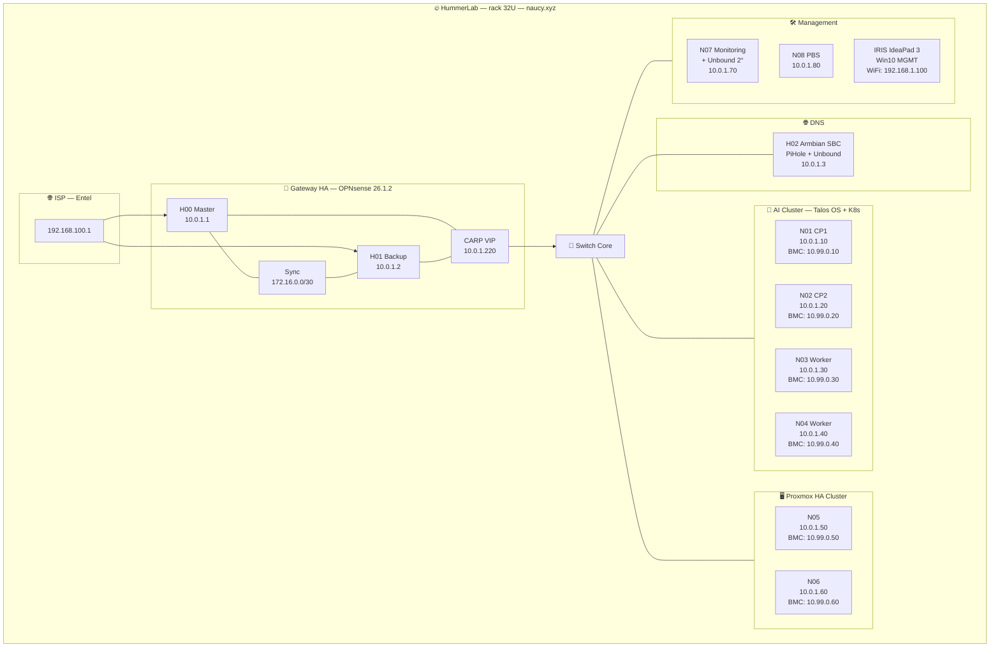

# 🔥 HummerLab Infrastructure


> Arquitectura self-hosted de grado profesional para IA (RAG), Domótica (MCP) e Infraestructura Crítica. Control total, sin dependencias de nube, sin suscripciones. Construido sobre hardware reciclado en un rack de 32U.

---

## 📋 Tabla de Contenidos

- [¿Por qué este proyecto?](#-por-qué-este-proyecto)
- [Topología del Sistema](#-topología-del-sistema)
- [Inventario de Hardware](#-inventario-de-hardware)
- [Stack Tecnológico](#-stack-tecnológico)
- [Redes](#-redes)
- [Estructura del Repositorio](#-estructura-del-repositorio)
- [Roadmap](#-roadmap)

---

## 💡 ¿Por qué este proyecto?

La mayoría de las implementaciones de IA dependen de APIs externas, servicios en la nube y costos recurrentes. HummerLab es una apuesta por la **soberanía tecnológica**: inferencia local, datos que no salen de la red, alta disponibilidad sin vendor lock-in.

Construido íntegramente con hardware reciclado sobre un rack de 32U, este laboratorio corre modelos LLM locales, gestiona domótica crítica y almacena datos vectoriales — con configuraciones reproducibles, documentadas y listas para producción.

---

## 🌐 Topología del Sistema



---

## 🖥️ Inventario de Hardware

### Baremetal — Rack (32U)

| Nodo | Rol | CPU | RAM | Storage | OS | IP LAN | BMC |
|------|-----|-----|-----|---------|-----|--------|-----|
| H00 | OPNsense Master | 2c | 4 GB | 80 GiB | OPNsense 26.1.2 | 10.0.1.1 | — |
| H01 | OPNsense Backup | 2c | 4 GB | 40 GiB | OPNsense 26.1.2 | 10.0.1.2 | — |
| H02 | DNS / PiHole / Unbound | 2c | 1 GB | 50 GiB | Armbian | 10.0.1.3 | — |
| N01 | Talos — Control Plane 1 | 8c | 32 GB | 4× 500 GiB | Talos OS | 10.0.1.10 | 10.99.0.10 |
| N02 | Talos — Control Plane 2 | 8c | 32 GB | 3× 500 GiB + 1 TiB | Talos OS | 10.0.1.20 | 10.99.0.20 |
| N03 | Talos — Worker IA | 8c | 32 GB | 2× 500 GiB + 2× 1 TiB | Talos OS | 10.0.1.30 | 10.99.0.30 |
| N04 | Talos — Worker IA | 8c | 32 GB | 2× 500 GiB + 2× 1 TiB | Talos OS | 10.0.1.40 | 10.99.0.40 |
| N05 | Proxmox Node 1 | 8c | 32 GB | 2× 500 GiB + 2× 1 TiB | Proxmox VE 9 | 10.0.1.50 | 10.99.0.50 |
| N06 | Proxmox Node 2 | 8c | 32 GB | 2× 320 GiB + 2× 1 TiB | Proxmox VE 9 | 10.0.1.60 | 10.99.0.60 |
| N07 | Monitoring + QDevice + DNS 2° | 4c | 6 GB | 250 GiB SSD | Debian 12 | 10.0.1.70 | — |
| N08 | PBS Backup | 2c | 2 GB | 4× SATA + 4× IDE | Debian 12 | 10.0.1.80 | — |

### Fuera de Rack

| Equipo | Rol | CPU | RAM | Storage | OS | IP |
|--------|-----|-----|-----|---------|----|----|
| IRIS (IdeaPad 3) | MGMT Personal / Backup | 4c | 20 GB | 500 GiB SSD + 1 TiB | Windows 10 | WiFi 192.168.1.100 |

### VPS Externos

| Nombre | Rol | CPU | RAM | Storage | OS |
|--------|-----|-----|-----|---------|-----|
| VPS001 | Web + Mail + DNS + VPN | 2c | 4 GB | 60 GiB | Ubuntu 24.04 |
| VPS002 | DNS secundario + VPN backup + MX | 4c | 8 GB | 140 GiB SSD | Ubuntu 24.04 |

---

## 🏗️ Stack Tecnológico

| Capa | Tecnología | Rol |
|------|-----------|-----|
| **Firewall/Gateway** | OPNsense 26.1.2 HA (CARP) | Entrada redundante, VPN, segmentación |
| **DNS primario** | PiHole + Unbound (H02 — Armbian SBC) | Filtrado + resolución recursiva |
| **DNS secundario** | Unbound LXC (N07) | Redundancia ante caída de H02 |
| **Compute IA** | Talos OS + Kubernetes | Cómputo inmutable para inferencia LLM |
| **Orquestación K8s** | Omni — Sidero Labs | Gestión del ciclo de vida Talos |
| **Inferencia LLM** | Ollama / LocalAI | Modelos locales sin API externa |
| **Virtualización** | Proxmox VE 9 HA | VMs y LXCs con alta disponibilidad |
| **Base de datos** | PostgreSQL + PgVector | Memoria largo plazo para RAG |
| **Vector Search** | Qdrant HA | Búsqueda semántica replicada |
| **HA DB** | Patroni + Etcd | Failover automático PostgreSQL |
| **Cache** | Redis + Sentinel | Cache HA para aplicaciones |
| **Load Balancer** | HAProxy + Keepalived + PgBouncer | VIPs y balanceo interno |
| **Domótica** | Home Assistant OS | Controlador MCP — Zigbee/Z-Wave |
| **Backup** | Proxmox Backup Server (N08) | Deduplicación + recuperación |
| **Quórum PVE** | Corosync QNetd (N07) | Árbitro externo anti split-brain |
| **Monitoreo** | VictoriaMetrics + Grafana + Loki | Observabilidad full-stack |
| **Gestión remota** | BMC/IPMI (10.99.0.x) | Acceso out-of-band a N01–N06 |

---

## 📡 Redes

**Dominio:** `naucy.xyz` | **Subred principal:** `10.0.1.0/24`

| Red | Subred | Propósito |
|-----|--------|-----------|
| LAN Core | 10.0.1.0/24 | Infraestructura principal |
| BMC/IPMI | 10.99.0.0/24 | Gestión remota out-of-band N01–N06 |
| OPNsense Sync | 172.16.0.0/30 | Enlace dedicado HA H00↔H01 |
| Cluster Private | 192.168.10.0/24 | Red privada NIC2 — backup inter-server |
| ISP | 192.168.100.0/24 | Uplink Entel |

### VIPs

| VIP | Servicio | IP |
|-----|---------|-----|
| CARP OPNsense | Gateway activo | 10.0.1.220 |
| Talos API | K8s Endpoint | 10.0.1.200 |
| DB VIP | PostgreSQL / Qdrant | 10.0.1.221 |
| HA VIP | Home Assistant | 10.0.1.222 |

---

## 📁 Estructura del Repositorio

```
HummerLab-Infrastructure/
├── Docs/               # ADRs, runbooks y referencias técnicas
├── Kubernetes/         # Manifests y configuraciones K8s
├── Proxmox/            # Configuración clúster PVE HA
├── Talos/              # Configs Talos y aprovisionamiento Omni
├── Topology/           # Diagramas de red y arquitectura
└── networking/         # OPNsense, DHCP, BMC, redes
```

---

## 🚀 Roadmap

- [x] Diseño de arquitectura y topología
- [x] Documentación capa Proxmox HA
- [x] Diagrama de red completo
- [x] Inventario de hardware y redes
- [ ] **Fase 1** — OPNsense HA + CARP + VPN
- [ ] **Fase 2** — Aprovisionamiento Talos Cluster (Omni)
- [ ] **Fase 3** — Proxmox HA + QDevice + PBS
- [ ] **Fase 4** — PostgreSQL HA (Patroni + PgVector + Qdrant + Redis)
- [ ] **Fase 5** — Stack IA (Ollama + RAG pipeline + Open WebUI)
- [ ] **Fase 6** — Home Assistant + integración MCP
- [ ] **Fase 7** — Observabilidad (VictoriaMetrics + Grafana + Loki)
- [ ] **Fase 8** — CI/CD y automatización del repo

---

**Infraestructura de grado profesional no requiere presupuesto enterprise — requiere criterio técnico, reciclaje inteligente y documentación seria.**
*GPL-2.0 — Úsalo, mejóralo, compártelo.*

---

## 📬 ¿Te sirve? ¿Tienes preguntas?

- 🐛 Reporta issues si algo no cuadra.
- 💬 Conéctame en [LinkedIn](https://www.linkedin.com/in/patricio-nunez-rgua/) si quieres charlar infra, IA o homelabs.

> *"El mejor código es el que otros pueden entender, mejorar y hacer suyo."*
