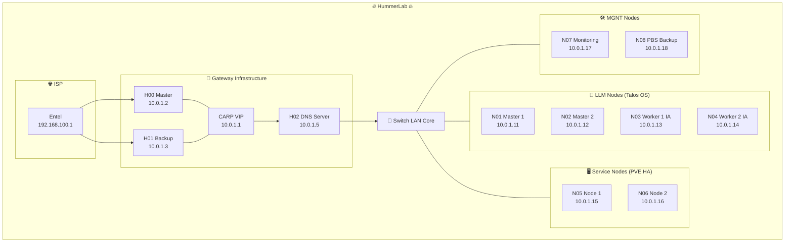

# 🔥 HummerLab Infrastructure


> Arquitectura self-hosted de grado profesional para IA (RAG), Domótica (MCP) e Infraestructura Crítica. Control total, sin dependencias de nube, sin suscripciones.

---

## 📋 Tabla de Contenidos

- [¿Por qué este proyecto?](#-por-qué-este-proyecto)
- [Topología del Sistema](#-topología-del-sistema)
- [Stack Tecnológico](#-stack-tecnológico)
- [Estructura del Repositorio](#-estructura-del-repositorio)
- [Networking](#-networking)
- [Roadmap](#-roadmap)
- [Cómo usar este repo](#-cómo-usar-este-repo)

---

## 💡 ¿Por qué este proyecto?

La mayoría de las implementaciones de IA dependen de APIs externas, servicios en la nube y costos recurrentes. HummerLab es una apuesta por la **soberanía tecnológica**: inferencia local, datos que no salen de la red, alta disponibilidad sin vendor lock-in.

Este laboratorio corre modelos LLM locales, gestiona domótica crítica y almacena datos vectoriales — todo sobre hardware propio, con configuraciones reproducibles y documentadas.

---

## 🌐 Topología del Sistema



---

## 🏗️ Stack Tecnológico

| Capa | Tecnología | Rol |
|------|-----------|-----|
| **Firewall/Gateway** | OPNsense HA (CARP) | Entrada redundante, segmentación VLAN |
| **DNS/Ad-block** | PiHole + Unbound | Resolución interna + filtrado |
| **Compute (IA)** | Talos OS + Kubernetes | Cómputo inmutable para inferencia LLM |
| **Orquestación K8s** | Omni (Sidero Labs) | Gestión del ciclo de vida Talos |
| **Inferencia LLM** | Ollama / LocalAI | Modelos locales sin API externa |
| **Virtualización** | Proxmox VE 9 HA | VMs y LXCs con alta disponibilidad |
| **Base de datos** | PostgreSQL + PgVector | Memoria de largo plazo para RAG |
| **Vector Search** | Qdrant HA | Búsqueda semántica replicada |
| **HA DB** | Patroni | Failover automático de PostgreSQL |
| **Load Balancer** | HAProxy + Keepalived | VIPs y balanceo interno |
| **Domótica** | Home Assistant OS | Controlador MCP con passthrough Zigbee/Z-Wave |
| **Backup** | Proxmox Backup Server | Deduplicación y recuperación ante desastres |
| **Quórum** | Corosync QNetd (N07) | Árbitro externo anti Split-Brain |

---

## 📁 Estructura del Repositorio

```
HummerLab-Infrastructure/
├── Docs/               # Decisiones de diseño y documentación general
├── Kubernetes/         # Manifests y configuraciones del clúster K8s
├── Proxmox/            # Configuración del clúster PVE HA
├── Talos/              # Configs de nodos y aprovisionamiento Omni
├── Topology/           # Diagramas de red y arquitectura
└── networking/         # OPNsense, VLANs, DHCP reservations
```

---

## 📡 Networking

**Dominio interno:** `naucy.xyz` | **Subred del lab:** `10.0.1.0/24`

| Host | Rol | IP |
|------|-----|----|
| H00 | OPNsense Master | 10.0.1.2 |
| H01 | OPNsense Backup | 10.0.1.3 |
| CARP VIP | Gateway activo | 10.0.1.1 |
| H02 | DNS (PiHole/Unbound) | 10.0.1.5 |
| N01 | Talos Master 1 | 10.0.1.11 |
| N02 | Talos Master 2 | 10.0.1.12 |
| N03 | Talos Worker IA | 10.0.1.13 |
| N04 | Talos Worker IA | 10.0.1.14 |
| N05 | Proxmox Node 1 | 10.0.1.15 |
| N06 | Proxmox Node 2 | 10.0.1.16 |
| N07 | Monitoring + QDevice | 10.0.1.17 |
| N08 | PBS Backup | 10.0.1.18 |
| Talos API VIP | K8s Endpoint | 10.0.1.10 |
| DB VIP | PostgreSQL/Qdrant | 10.0.1.100 |
| HA VIP | Home Assistant | 10.0.1.101 |

---

## 🚀 Roadmap

- [x] Diseño de arquitectura y topología
- [x] Documentación de capa Proxmox HA
- [x] Diagrama de red completo
- [ ] **Fase 1** — OPNsense HA + VLANs
- [ ] **Fase 2** — Aprovisionamiento Talos Cluster (Omni)
- [ ] **Fase 3** — PostgreSQL HA (Patroni + PgVector + Qdrant)
- [ ] **Fase 4** — Despliegue de stack IA (Ollama + RAG pipeline)
- [ ] **Fase 5** — Observabilidad (Prometheus + Grafana + Loki)
- [ ] **Fase 6** — CI/CD y automatización del repo

---

## 🛠️ Cómo usar este repo

Cada carpeta contiene su propio `README.md` con instrucciones específicas. El orden recomendado de implementación sigue el roadmap de arriba: red primero, compute segundo, datos tercero, aplicaciones al final.

```bash
git clone https://github.com/HummerFire/HummerLab-Infrastructure.git
cd HummerLab-Infrastructure
```

---

**Este proyecto es parte de una iniciativa personal para democratizar infraestructuras de IA soberanas y domótica avanzada.**  
*GPL-2.0 — Úsalo, mejóralo, compártelo.*
