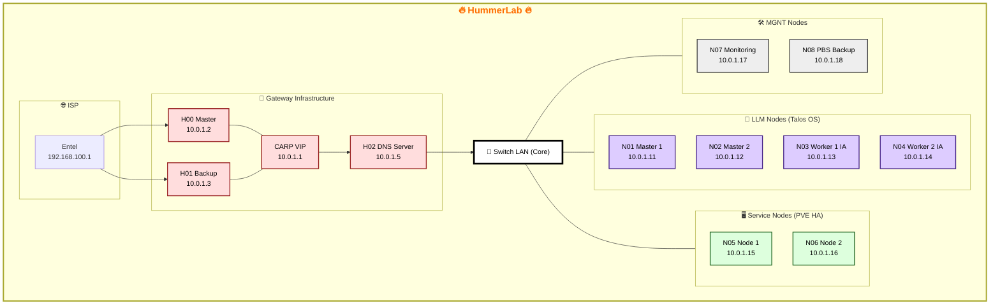

# 🌐 HummerLab Network Topology

Este documento detalla la arquitectura de red del **HummerLab**, un ecosistema diseñado para la alta disponibilidad (HA), la soberanía de datos y el cómputo de Inteligencia Artificial. La red se organiza en una topología de estrella con un núcleo de red central y capas de servicios especializados.

## 🗺️ Mapa de Red ([Visualización](https://mermaid.ai/d/232fba26-2a5b-41c8-be71-ae3e3bbfff9c))

## 🏗️ Desglose de Capas

### 📡 1. Infraestructura de Gateway (HA)
El punto de entrada está protegido por un clúster de firewalls en **Alta Disponibilidad (HA)** utilizando el protocolo **CARP**.
* **Redundancia:** Si el nodo `H00` falla, `H01` asume el tráfico de forma transparente mediante la **CARP VIP** (`10.0.1.1`).
* **Servicio DNS:** El nodo `H02` centraliza la resolución de nombres local y el filtrado de publicidad/amenazas mediante **PiHole/Unbound**.

### 🤖 2. LLM Nodes (Cómputo Inmutable)
Segmento dedicado a la inteligencia artificial ejecutando **Talos OS**, un sistema operativo endurecido y diseñado específicamente para Kubernetes.
* **Control Plane:** Dos masters gestionan la orquestación y el estado del clúster.
* **Inferencia:** Dos workers equipados para el procesamiento de lenguaje natural y ejecución de modelos locales (**Ollama/LocalAI**).

### 🖥️ 3. Service Nodes (Persistencia)
Nodos corriendo **Proxmox VE (PVE)** en configuración de alta disponibilidad para servicios críticos.
* **Estado:** Alojan bases de datos relacionales y vectoriales (**PostgreSQL/Qdrant**) junto a la instancia de **Home Assistant**.
* **Resiliencia:** Configurados con replicación de almacenamiento para permitir migraciones en caliente (*live migration*) sin interrupción de servicio.

### 🛠️ 4. MGNT Nodes (Apoyo & Gestión)
Infraestructura vital para el mantenimiento, observabilidad e integridad del laboratorio.
* **N07 (Monitoring):** Centraliza métricas/logs y actúa como **QDevice** para asegurar el quórum legal en el clúster Proxmox.
* **N08 (Backup):** Servidor de respaldos dedicado (**Proxmox Backup Server**) que garantiza la recuperación ante desastres de todos los nodos del ecosistema.

---

> [!IMPORTANT]
> **Nota Técnica:** Todas las comunicaciones internas fluyen a través de un **Switch LAN Core** de baja latencia, optimizando el rendimiento entre los motores de inferencia IA y las bases de datos vectoriales.
